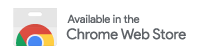

# Next.js Explorer

Next.js Explorer is a browser extension for Google Chrome and Firefox designed to help developers explore and visualize the structure and data of their Next.js applications.

[](https://chromewebstore.google.com/detail/nextjs-explorer-nextjs-ap/iiekmbomdcmddchlplbdlkkpdgncgpdg)
[](https://addons.mozilla.org/en-US/firefox/addon/nextjs/)

## Getting Started

To get started with Next.js Explorer, follow the steps below.

### Prerequisites

Make sure you have the following installed:

- Node.js (v20 or higher)
- npm or yarn
- Chrome or Firefox for testing the extension

### Installation

Clone the repository to your local machine:

```bash
git clone https://github.com/alcoceba/next.js-explorer.git
cd next.js-explorer
```

Install the necessary dependencies:

```bash
npm install
# or
yarn install
```

### Development

To bundle the project and load it as a Google Chrome extension or Firefox addon:

- **For Chrome:**

  ```bash
  npm run watch:chrome
  ```

  This command will bundle the project and watch for changes, allowing you to load it as an extension in Chrome.

- **For Firefox:**

  ```bash
  npm run watch:firefox
  ```

  This command will bundle the project and watch for changes, allowing you to load it as an addon in Firefox.

After running one of these commands, follow the steps below to load the extension/addon:

#### For Chrome:

1. Open Chrome and go to `chrome://extensions/`.
2. Enable "Developer mode" (toggle switch in the top-right corner).
3. Click on "Load unpacked" and select the `dist/chrome` directory.

#### For Firefox:

1. Open Firefox and go to `about:debugging`.
2. Click on "This Firefox" in the sidebar.
3. Click on "Load Temporary Add-on" and select the `dist/firefox/manifest.json` file.

### Building for Production

To build the project for production:

- **For Chrome:**

  ```bash
  npm run build:chrome
  ```

  This command will create a production-ready bundle for Chrome in the `dist/chrome` directory.

- **For Firefox:**

  ```bash
  npm run build:firefox
  ```

  This command will create a production-ready bundle for Firefox in the `dist/firefox` directory.
  
## License

This project is licensed under the BSD 3-Clause License - see the [LICENSE](LICENSE) file for details.
